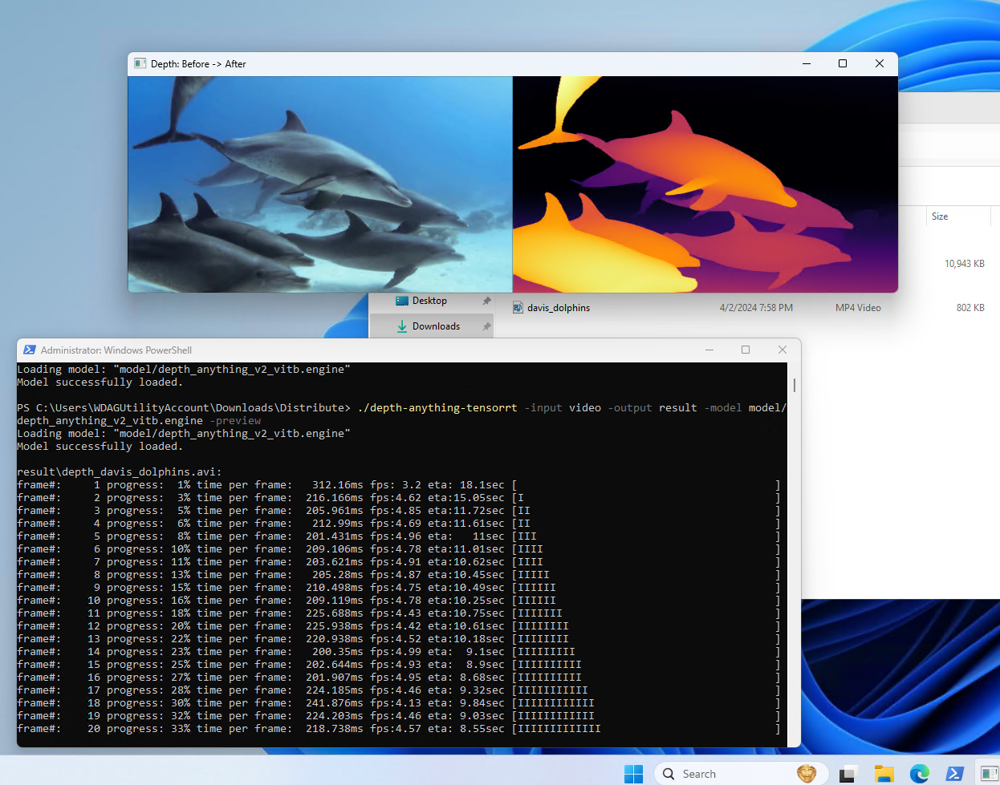

<div align="left">

Depth Anything TensorRT CLI
===========================

[](https://www.python.org/downloads/release/python-31012/)
[](https://developer.nvidia.com/cuda-downloads)
[](https://developer.nvidia.com/tensorrt)
[](https://github.com/spacewalk01/depth-anything-tensorrt/blob/main/LICENSE)

</div>

Depth estimation is the task of measuring the distance of each pixel relative to the camera. This repo provides a TensorRT implementation of the [Depth-Anything](https://github.com/LiheYoung/Depth-Anything) depth estimation model in both C++ and Python, enabling efficient real-time inference.

<p align="center">
  Depth-Anything-V1
  
</p>
<p align="center">
  Depth-Anything-V2
  
</p>


## News
* **2024-08-20:** Added CLI (xa1on)
* **2024-06-20:** Added support for TensorRT 10.
* **2024-06-17:** [Depth Anything V2](https://github.com/DepthAnything/Depth-Anything-V2) has been integrated.
* **2024-01-23:** The Depth Anything [TensorRT](https://github.com/spacewalk01/depth-anything-tensorrt) version has been created.
  
## ⏱️ Performance

The inference time includes the pre-preprocessing and post-processing stages:
| Device          | Model | Model Input (WxH) |  Image Resolution (WxH)|Inference Time(ms)|
|:---------------:|:------------:|:------------:|:------------:|:------------:|
| RTX4090        | Depth-Anything-S  |518x518  |  1280x720    | 3     |
| RTX4090        | Depth-Anything-B  |518x518  |  1280x720    | 6     |
| RTX4090        | Depth-Anything-L  |518x518  |  1280x720    | 12    |


> [!NOTE]
> Inference was conducted using `FP16` precision, with a warm-up period of 10 frames. The reported time corresponds to the last inference.

## 🚀 Quick Start

#### C++

- **Step 1**: Create an engine from an onnx model and save it:
``` shell
depth-anything-tensorrt.exe -model <onnx model>
```
- **Step 2**: Deserialize an engine. Once you've built your engine, the next time you run it, simply use your engine file:
``` shell
depth-anything-tensorrt.exe -model <engine file> -input <input image or video>
```
- Alternatively, you can skip immediately to running the model with just an onnx file, however, it will still generate a engine file.
``` shell
depth-anything-tensorrt.exe -model <onnx model> -input <input image or video>
```

Example:
``` shell
# infer image
depth-anything-tensorrt.exe -model depth_anything_vitb14.engine -input test.jpg
# infer folder(images/videos)
depth-anything-tensorrt.exe -model depth_anything_vitb14.engine -input data # folder containing videos/images
# infer video
depth-anything-tensorrt.exe -model depth_anything_vitb14.engine -input test.mp4 # the video path
# specify output location
depth-anything-tensorrt.exe -model depth_anything_vitb14.engine -input test.mp4 -output result # rendered depth maps will go into the "results" directory
# display progress in one line rather than multiple
depth-anything-tensorrt.exe -model depth_anything_vitb14.engine -input test.mp4 -one-line
# modify prefix of generated files (default: "depth_")
depth-anything-tensorrt.exe -model depth_anything_vitb14.engine -input test.mp4 -prefix "depthify_" # rendered depth map will have the name "depthify_test.mp4"
# show preview including before and after (may slow down performance)
depth-anything-tensorrt.exe -preview -model depth_anything_vitb14.engine -input test.mp4
# modify fps of footage (does not interpolate, will speed up or slow down footage if original video file has a different fps value)
depth-anything-tensorrt.exe -model depth_anything_vitb14.engine -input test.mp4 -fps 60
# use an existing engine file if found
depth-anything-tensorrt.exe -model depth_anything_vitb14.onnx -input test.mp4 -find-engine
```

<p align="center">
  
</p>

#### Python

```
cd depth-anything-tensorrt/python

# infer image
python trt_infer.py --engine <path to trt engine> --img <single-img> --outdir <outdir> [--grayscale]
```

## 🛠️ Build

#### C++

Refer to our [docs/INSTALL.md](https://github.com/spacewalk01/depth-anything-tensorrt/blob/main/docs/INSTALL.md) for C++ environment installation.

#### Python

``` shell
cd <tensorrt installation path>/python
pip install cuda-python
pip install tensorrt-8.6.0-cp310-none-win_amd64.whl
pip install opencv-python
``` 

## 🤖 Model Preparation
### Depth-Anything-V1
Perform the following steps to create an onnx model:

1. Download the pretrained [model](https://huggingface.co/spaces/LiheYoung/Depth-Anything/tree/main/checkpoints) and install [Depth-Anything](https://github.com/LiheYoung/Depth-Anything):
   ``` shell
   git clone https://github.com/LiheYoung/Depth-Anything
   cd Depth-Anything
   pip install -r requirements.txt
   ```
  
2. Copy [dpt.py](https://github.com/spacewalk01/depth-anything-tensorrt/blob/main/depth_anything_v1/dpt.py) in depth_anything_v1 from this repo to `<Depth-Anything-Installpath>/depth_anything` folder. And, Copy [export_v1.py](https://github.com/spacewalk01/depth-anything-tensorrt/blob/main/depth_anything_v1/export_v1.py) in depth_anything_v1 from this repo to `<Depth-Anything-Installpath>` folder.
3. Export the model to onnx format using [export_v1.py](https://github.com/spacewalk01/depth-anything-tensorrt/blob/main/depth_anything_v1/export_v1.py). You will get an onnx file named `depth_anything_vit{}14.onnx`, such as `depth_anything_vitb14.onnx`. Note that I used torch cpu version for exporting the onnx model as it is not necessary to deploy the model on GPU when exporting.

    
    ``` shell
    conda create -n depth-anything python=3.8
    conda activate depth-anything
    pip install torch torchvision
    pip install opencv-python
    pip install onnx
    python export_v1.py --encoder vitb --load_from depth_anything_vitb14.pth --image_shape 3 518 518
    ```


### Depth-Anything-V2

1. Clone [Depth-Anything-V2](https://github.com/DepthAnything/Depth-Anything-V2.git) 
   ``` shell
   git clone https://github.com/DepthAnything/Depth-Anything-V2.git
   cd Depth-Anything-v2
   pip install -r requirements.txt
   ```
2. Download the pretrained models from the [readme](https://github.com/DepthAnything/Depth-Anything-V2.git) and put them in checkpoints folder:
3. Copy [dpt.py](https://github.com/spacewalk01/depth-anything-tensorrt/blob/main/depth_anything_v2/dpt.py) in depth_anything_v2 from this repo to `<depth_anything_installpath>/depth_anything_v2` folder. And, Copy [export_v2.py](https://github.com/spacewalk01/depth-anything-tensorrt/blob/main/depth_anything_v2/export_v2.py) in depth_anything_v2 from this repo to `<depth_anything_installpath>` folder.
4. Run the following to export the model:
    ``` shell
    conda create -n depth-anything python=3.8
    conda activate depth-anything
    pip install torch torchvision
    pip install opencv-python
    pip install onnx
    cd Depth-Anything-V2
    python export_v2.py --encoder vitb --input-size 518
    ```

> [!TIP]
> The width and height of the model input should be divisible by 14, the patch height.


## 👏 Acknowledgement

This project is based on the following projects:
- [Depth-Anything](https://github.com/LiheYoung/Depth-Anything) - Unleashing the Power of Large-Scale Unlabeled Data.
- [TensorRT](https://github.com/NVIDIA/TensorRT/tree/release/8.6/samples) - TensorRT samples and api documentation.
