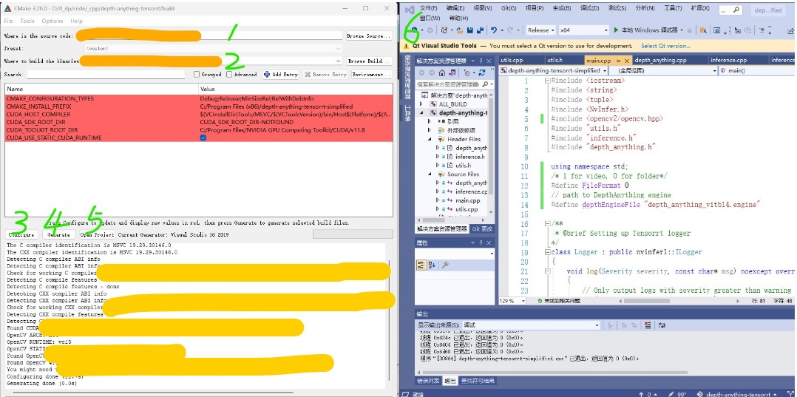

<h1 align="center"><span>Depth-Anything TensorRT C++</span></h1>

Depth estimation is the task of measuring the distance of each pixel relative to the camera. This repository contains a C++ implementation of the [Depth-Anything](https://github.com/LiheYoung/Depth-Anything) model using the TensorRT API for real-time inference.

<p align="center" margin: 0 auto;>
  
</p>

## Performance
The inference time includes the pre-preprocessing and post-processing stages:
| Device          | Model | Model Input (WxH) |  Image Resolution (WxH)     | Inference Time(ms) |
|:---------------:|:------------:|:------------:|:------------:|:------------:|
| RTX4090        | `Depth-Anything-S`  |518x518  |  1280x720    | 3     |
| RTX4090        | `Depth-Anything-B`  |518x518  |  1280x720    | 6     |
| RTX4090        | `Depth-Anything-L`  |518x518  |  1280x720    | 12     |

Note that the inference was conducted using `FP16` precision, with a warm-up period of 10 frames, and the reported time corresponds to the last inference.

## Setup 

1. Download the pretrained [model](https://huggingface.co/spaces/LiheYoung/Depth-Anything/tree/main/checkpoints) and install [Depth-Anything](https://github.com/LiheYoung/Depth-Anything):
   ```
   git clone https://github.com/LiheYoung/Depth-Anything
   cd Depth-Anything
   pip install -r requirements.txt
   ```

2. Copy and paste `dpt.py` to `<depth_anything_installpath>/depth_anything` folder.


    <details>
    <summary>Note</summary>
       Here I've only removed a squeeze operation at the end of model's forward function in `dpt.py` to avoid conflicts with TensorRT
    </details>       
    
3. Export the model to onnx format using `export_to_onnx.py`, you will get an onnx file named "depth_anything_vit{}14.onnx", such as "depth_anything_vitb14.onnx".
4. Install TensorRT using the guide below (Windows) or TensorRT official guidance.
    <details>
    <summary>Click here for the guide</summary>  
      
    1. Download the [TensorRT](https://developer.nvidia.com/tensorrt) zip file that matches the Windows version you are using.
    2. Choose where you want to install TensorRT. The zip file will install everything into a subdirectory called `TensorRT-8.x.x.x`. This new subdirectory will be referred to as `<installpath>` in the steps below.
    3. Unzip the `TensorRT-8.x.x.x.Windows10.x86_64.cuda-x.x.zip` file to the location that you chose. Where:
    - `8.x.x.x` is your TensorRT version
    - `cuda-x.x` is CUDA version `11.6`, `11.8` or `12.0`
    4. Add the TensorRT library files to your system `PATH`. To do so, copy the DLL files from `<installpath>/lib` to your CUDA installation directory, for example, `C:\Program Files\NVIDIA GPU Computing Toolkit\CUDA\vX.Y\bin`, where `vX.Y` is your CUDA version. The CUDA installer should have already added the CUDA path to your system PATH.
    5. Ensure that the following is present in your Visual Studio Solution project properties:
    - `<installpath>/lib` has been added to your PATH variable and is present under **VC++ Directories > Executable Directories**.
    - `<installpath>/include` is present under **C/C++ > General > Additional Directories**.
    - nvinfer.lib and any other LIB files that your project requires are present under **Linker > Input > Additional Dependencies**.
    </details>

5. Find **trtexec** whereis, and then export onnx to engine.
   ```
   trtexec --onnx=depth_anything_vitb14.onnx --saveEngine=depth_anything_vitb14.engine
   ```

Add **--fp16** if you want to enable fp16 precision
   ```
   trtexec --onnx=depth_anything_vitb14.onnx --saveEngine=depth_anything_vitb14.engine -fp16
   ```

6. Download and install any recent [OpenCV](https://opencv.org/releases/) for Windows.
    
7. Modify CMakelists.txt, change TensorRT and OpenCV pathes.
   ```
   # Find and include OpenCV
   set(OpenCV_DIR "path to OpenCV")
   find_package(OpenCV REQUIRED)
   include_directories(${OpenCV_INCLUDE_DIRS})
   
   # Set TensorRT path if not set in environment variables
   set(TENSORRT_DIR "path to TensorRT")
   ```

8. Modify main.cpp, change FileFormat, depthEngineFile, VideoPath and imageFolderPath these variables.
   ```
   #define FileFormat 0 
   #define depthEngineFile "depth_anything_vitb14.engine"
   string VideoPath = "wuhan_day.avi";
   string imageFolderPath = "mytest/";
   ```
  
   9. Build project by using **cmake-gui** or following commands.
   
   ```bash
   mkdir build
   cd build
   cmake ..
   make
   ```


## Acknowledgement
This project is based on the following projects:
- [Depth-Anything](https://github.com/LiheYoung/Depth-Anything) - Unleashing the Power of Large-Scale Unlabeled Data.
- [TensorRT](https://github.com/NVIDIA/TensorRT/tree/release/8.6/samples) - TensorRT samples and api documentation.

## Contribute
Thanks to the following people for their contributions to this project:

- [spacewalk01](https://github.com/spacewalk01)
- [lbq779660843](https://github.com/lbq779660843)